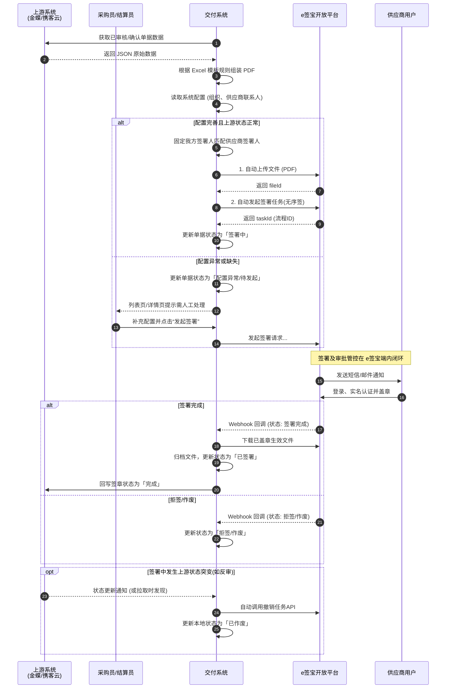
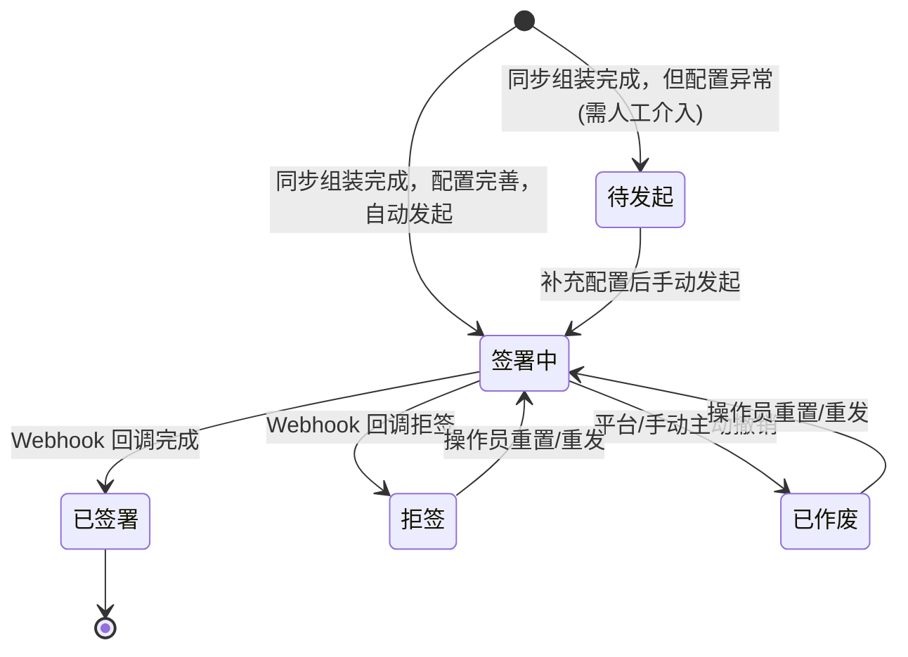

# 核心业务流程设计 (Core Process Design)

本文档描述了**采购单与对账单 e签宝对接**的核心业务流程、系统交互以及状态流转。

## 1. 核心流程泳道图 (Cross-functional Flowchart)

本图展示了从上游获取数据、生成单据，到交付系统发起、e签宝平台内管控以及最终归档的完整主干流程。

```mermaid
flowchart TD
  subgraph upstream ["上游系统 (金蝶 / 携客云)"]
    K[金蝶采购单 \n 状态: 已审核]
    X[携客云对账单 \n 状态: 已确认]
  end

  subgraph delivery ["交付系统"]
    A[拉取/同步单据数据]
    B[校验数据与组装 PDF 文件]
    C{上游状态满足 \n 且 配置完善?}
    D[固定我方签署人\n匹配供应商签署人]
    F[自动调用 e签宝API创建签署任务\n更新状态: 签署中]
    Err[标记状态: 配置异常/待发起\n(需人工介入补充)]
    E[人工补充配置/确认无误后\n手动点击 发起签署]
    H[接收 Webhook 回调或主动查询]
    I[更新状态: 已签署/已拒签\n归档生效 PDF]
    J[回写携客云签章状态为完成]
    Revoke[监测到上游反审自动调用作废]
  end

  subgraph esign ["e签宝平台"]
    G1[流转用印与审批\n发送签署通知]
    G2[供应商实名与确认意愿\n进行电子盖章]
    G3[流程完结]
  end

  K -.-> A
  X -.-> A
  
  A --> B
  B --> C
  C -->|否| Err
  Err --> E
  E --> D
  C -->|是| D
  D --> F
  
  F --> G1
  G1 --> G2
  G2 --> G3
  
  G3 -- 触发 Webhook --> H
  H --> I
  I --> J
  K -.->|状态突变:反审核| Revoke
  X -.->|状态突变:取消确认| Revoke
```

## 2. 系统交互时序图 (System Sequence Diagram)

本图展示了具体系统间的 API 调用时序和交互，重点体现了数据获取、自动发起签署请求和异常人工处理机制。



## 3. 状态机流转 (State Machine)

对交付系统内**采购单/对账单**在当前对接范畴下的状态流转进行定义。


