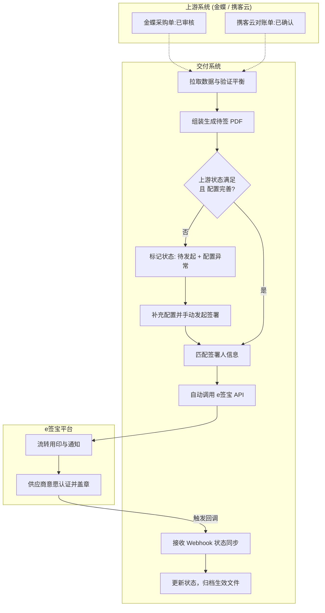
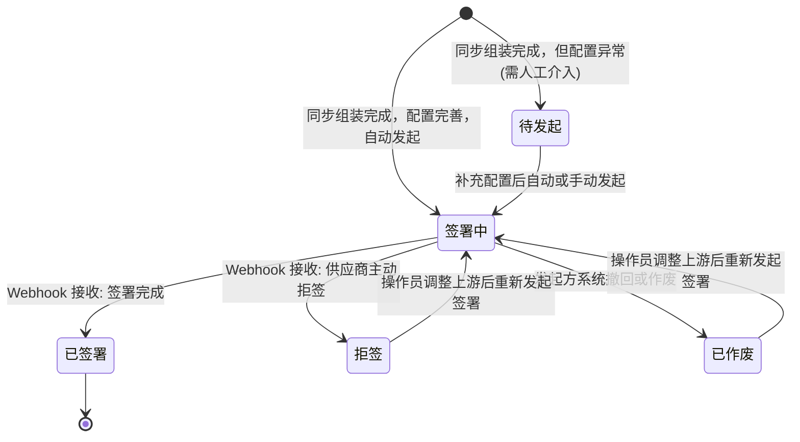

# 采购对账 e签宝对接模块 PRD

| 属性 | 信息 |
| --- | --- |
| 项目/需求关键词 | 采购对账、e签宝对接、电子盖章 |
| PRD 版本 | v1.1 |
| 编写日期 | 2026-06-10 |
| 关联需求链 | [x] 01_Parsing / [x] 02_RequirementAnalysis / [x] 03_CoreProcessDesign / [ ] 04_Benchmark |

## PRD 修改记录

| 变更时间 | 变更内容 | 修改人 | 版本号 |
| --- | --- | --- | --- |
| 2026-06-10 | 初始版本，确立采购单与对账单集成 e签宝电子签署的核心流程与规则 | 业务产品/系统分析 | v1.0 |
| 2026-06-10 | 基于原型交互迭代更新：1. 明确自动发起机制；2. 增加异常状态(配置缺失/上游异常)分离提示；3. 移除详情页，列表点击单号直跳上游系统；4. 按钮交互变更为"复制签署链接"与"重新发起签署"；5. "联系人"统一修改为"签署人" | 业务产品/系统分析 | v1.1 |

---

## 1. 需求描述与交互

### 1.1 功能模块说明（必备）

- **模块事项与价值概览**：
  原本在“携客云”系统中管理的采购订单和对账单，现需对接到“交付系统”中管理，并实现与第三方 e签宝 对接，发起具有法律效力的电子签署。打通上下游业务闭环，提高单据核实和用印效率。
- **与上下游模块关系**：
  - **上游**：依赖金蝶 ERP（采购单）、携客云（对账单）。系统列表中点击单号提供直接跳转至上游系统原单详情页的快捷入口。
  - **内部依赖**：需要系统内预先配置好供应商映射关系和内部组织用印信息。
  - **下游**：对接 e签宝开放平台（发起签署、Webhook 状态监听、文件下载）。
- **本模块 P0/P1 范围摘要**：
  - P0：从上游系统同步单据及其状态，并能渲染为 PDF 模板文件。
  - P0：向 e签宝推送单据并发起签署，接收 Webhook 签署状态与已盖章文件回传。
  - P1：供应商签署人与内部用印配置、系统内单据签署状态的可视化跟进、异常状态拦截与人工补发。

### 1.2 功能详细需求逻辑阐述（必备）

#### 功能点 1：上游数据同步与单据模板生成
- **业务目标**：准确获取上游单据数据，确保用来签署的 PDF 文件真实反映 ERP 中终态数据。
- **处理规则**：
  - **状态与异常监控**：拉取金蝶“采购单”和携客云“对账单”。只有当上游状态为`已审核`（金蝶）或`已确认`（携客云）时才属于正常状态。若拉取到其他状态（如反审核、取消确认），交付系统需在列表中通过独立的异常标识（如`上游异常`）进行高亮警示拦截。
  - **金额强校验**：对于对账单，在生成时需验证：`对账含税金额 = 货明细含税汇总 - 仓退明细含税汇总 + 费用含税`。若公式配平失败，阻断生成并在系统内报错，防范资损。
  - **PDF 渲染**：将 JSON 格式的单据表头、明细、金额及强制业务条款渲染至事先确定的 Excel/PDF 模板样式中。
  
#### 功能点 2：自动匹配供应商与内部印章配置
- **业务目标**：解放采购和财务的人工填写工作，基于供应商名称/编码精准推送信件。
- **处理规则**：
  - 通过单据内的“供应商名称/编码”去【签署配置管理】查询绑定的外部签署人及联系电话。
  - 若配置缺失或为空，系统标记单据为`配置异常/待发起`，拦截自动发起流程，需人工介入补充配置后，方可手动发起签署。

#### 功能点 3：e签宝电子签署任务管理
- **业务目标**：将准备好的 PDF 文件推向 e签宝平台执行盖章交互。
- **主流程步骤**：
  1. 系统校验上游单据状态（如：金蝶已审核）正常且签署配置无误后，**自动触发**发起签署。
  2. 系统按序调用 e签宝接口：自动上传 PDF 文件 -> 创建签署任务（包含内外部主体、签署坐标、手机号）。
  3. 交付系统本地将状态自动置为`签署中`。
  4. 对于前期因配置异常被拦截的单据，在操作员补充配置后，可通过列表中点击【去补充配置】并在配置页完善后，系统解锁流程允许再次发起。
  5. 后续供应商意愿认证、验证码、用印等全过程在 e签宝平台上流转。
  6. e签宝签署结束/拒签后，通过 Webhook 触发交付系统对应更新状态；已签署则将生效 PDF 存入交付系统本地并存档。
- **异常情况与处理**：
  - **Webhook 丢失/超时兜底**：系统提供“同步状态”按钮，允许手动拉取 e签宝状态。
  - **上游状态突变拦截**：若单据处于“待发起”且上游变为非审核状态，禁止发起；若处于“签署中”且上游状态变为异常，提供明显的撤回/作废警示。
  - **手动辅助下发**：提供“复制签署链接”能力，便于采购/财务通过微信等私域工具将 e签宝短链定向发给供应商签署人。

**业务流程图**：

### 1.3 字段详细阐述（必备）

#### 表 1：单据待签核心表头字段

| 字段名称 | 字段含义 | 类型 | 是否必填 | 字段来源 | 备注 |
| --- | --- | --- | --- | --- | --- |
| `source_system` | 来源系统 | Enum | 是 | 交付系统自动判定 | 选项: 金蝶 / 携客云 |
| `bill_type` | 单据类型 | Enum | 是 | 上游同步 | 选项: 采购订单 / 对账单 |
| `bill_no` | 单据编号 | String | 是 | 上游同步 | 唯一主键，点击直跳上游系统单据详情页 |
| `upstream_status` | 上游单据状态 | String | 是 | 上游同步 | 金蝶: 已审核/反审核等；携客云: 已确认/取消确认等 |
| `supplier_name` | 供应商名称 | String | 是 | 上游同步 | 用于匹配签署配置 |
| `total_amount_tax` | 价税合计/对账含税金额 | Decimal(12,2) | 是 | 上游同步 | 需要做业务金额平账校验 |
| `esign_file_id` | 待签署文件 ID | String | 否 | e签宝接口回传 | 文件上传至 e签宝后返回的凭证 |
| `esign_task_id` | 签署任务 ID | String | 否 | e签宝接口回传 | 用于查询和撤销流程的唯一凭证 |
| `esign_status` | 签署状态 | Enum | 是 | 交付系统 / e签宝回调 | 待发起、签署中、已签署、拒签、已作废 |
| `exception_tag` | 异常拦截标识 | Enum | 否 | 交付系统自动判定 | 选项: 配置缺失 / 上游异常，独立于主状态展示 |
| `completed_pdf_url` | 最终签署文件地址 | String | 否 | 交付系统本地归档 | 签署完成后落地保存的文件地址 |

#### 表 2：签署配置表字段

| 字段名称 | 字段含义 | 类型 | 是否必填 | 字段来源 | 备注 |
| --- | --- | --- | --- | --- | --- |
| `supplier_code` | 供应商编码 | String | 是 | ERP主数据 | 与上游对齐的唯一编码 |
| `supplier_name` | 供应商名称 | String | 是 | ERP主数据 | |
| `contact_name` | 签署人 | String | 是 | 人工维护 | 接收签署通知的关键人 |
| `contact_phone` | 联系电话 | String | 是 | 人工维护 | 用于 e签宝实名校验和短信下发 |
| `email` | 邮箱 | String | 否 | 人工维护 | |
| `org_seal_id` | 默认内部用印组织ID | String | 否 | 人工维护 | 可选，静默签时传入 |

### 1.4 搜索查询说明

| 查询条件 | 组件类型 | 说明 |
| --- | --- | --- |
| `单据类型` | 下拉单选 | 采购订单、对账单 |
| `上游单据状态` | 下拉单选 | 正常、异常(反审核/取消确认等) |
| `签署状态` | 下拉多选 | 待发起、签署中、已签署、拒签、已作废 |
| `供应商名称` | 输入框 (模糊匹配) | 支持关键字查询 |
| `单据编号` | 输入框 (精确匹配) | 精确查找 |
| `发起日期` | 日期区间选择 | 查询任务发起的日期范围 |

### 1.5 状态机（必备）

**状态图**：

**权限与操作矩阵**：

| 角色 | 数据范围 | 单据状态 | 可执行操作 |
| --- | --- | --- | --- |
| 采购员 | 自己负责的采购单 | 待发起 (异常) | 去补充配置、跳转上游详情 |
| 采购员 | 自己负责的采购单 | 签署中 / 拒签 | 复制签署链接、同步状态、重新发起签署、强制撤回 |
| 财务/结算员 | 自己负责的对账单 | 待发起 (异常) | 去补充配置、跳转上游详情 |
| 财务/结算员 | 自己负责的对账单 | 签署中 / 拒签 | 复制签署链接、同步状态、重新发起签署、强制撤回 |
| 全局阅览者 | 全部单据 | 已签署 | 下载签署件 |

### 1.6 按钮操作描述

| 按钮 | 行为 | 前置条件 | 后置结果 |
| --- | --- | --- | --- |
| **去补充配置** | 跳转到“供应商签署配置”界面 | 状态为“待发起”且标识为“配置缺失” | 用户维护好“签署人”信息后可再次流转 |
| **复制签署链接** | 提取该单据在 e签宝 对应的短链接推入剪贴板 | 状态为“签署中”、“拒签”等 | 用户可线下直接将链接发送给供应商 |
| **重新发起签署** | 重新调取上游最新数据组装并再次触发签署流程 | 状态为“拒签”、“已作废”等 | 丢弃旧记录，生成新任务，状态进入“签署中” |
| **同步状态** | 主动调接口查询 e签宝的最新状态 | 状态为“签署中” | 更新本地状态（签署中/已签署/拒签） |
| **强制撤回** | 终止正在进行的签署流程 | 状态为“签署中” (尤加上游状态异常时) | e签宝中断任务，单据状态变更为“已作废” |
| **下载合同**| 提供已落章 PDF 文件下载 | 状态为“已签署” | 浏览器直接下载最终生效版 PDF |

### 1.7 通知提醒设计

| 触发条件 | 通知对象 | 通知方式 | 通知内容 | 通知频次 |
| --- | --- | --- | --- | --- |
| **流程创建成功** | 外部供应商(签署人) | e签宝短信/邮件（平台能力） | 您有一份[xx公司]发起的[采购单/对账单]待签署... | 每次发起触发一次 |
| **单据拒签** | 内部发起人 | 交付系统站内信/企微推送 | [单据号] 供应商存在金额异议已拒签，请及时处理 | 实时触发 |

---

## 2. 上线准备

### 2.1 初始化数据、历史数据处理（如有）
- **基础配置初始化**：必须在上线前，导入存量常用活跃供应商的 e签宝对接签署人及联系电话。
- **历史单据隔离**：上线之前已经在线下或携客云内部盖章完的存量对账单，不触发自动向 e签宝的补签，仅针对上线之后新建或处于“未签署”状态的单据进行推送。

### 2.2 运营事项、关注指标（如有）

| 指标名称 | 定义 | 计算公式 | 数据来源 |
| --- | --- | --- | --- |
| 签署成功率 | 成功完成电子盖章的比例 | 已签署单据数 / 总发起签署单据数 | 交付系统单据状态表 |
| 拦截提醒解决时长 | 从因“配置缺失”拦截到成功发起的耗时 | ∑(成功发起时间 - 首次被拦截时间) / 笔数 | 交付系统状态日志 |
| 平均签署时长 | 从单据发起签署到供应商完成盖章的耗时 | ∑(已签署时间 - 发起时间) / 已签署笔数 | e签宝 Webhook 及本地状态日志 |

---

## 附：本模块待决事项

| 编号 | 待决问题 | 责任方 | 目标结论日期 |
| --- | --- | --- | --- |
| 1 | **上游单据撤回强锁单机制**：金蝶中的采购单若被财务反审核修改金额，但此时交付系统正在签署中，除了交付系统界面拦截高亮外，是否要直接强制触发作废，还是提供显性警示依赖人工撤回？ | PM / 业务负责人 | 研发提测前 |
| 2 | **合同条款声明变更**：新生成的 PDF 中，底部的说明文字需要业务部门和法务确认从“传真/邮件扫描视为有效”统一更改为电子签章具备法律效力的标准化表述，并提供最终文本。 | 业务 / 法务 | 研发提测前 |
| 3 | **企业认证流程**：供应商在收到 e签宝通知时，如果其主体之前从未在 e签宝注册和实名，e签宝的认证前置流程对某些小微供应商是否有阻力，需确定沟通推进话术。 | 采购运营 | 上线前 |
